# mf_linux

Ferramenta de tuning nativa para Linux, compatível com ECUs **Speeduino** que usam o protocolo
serial do **TunerStudio** (comandos com CRC). Sem Wine e sem Windows: mostra o motor ao vivo, lista
todos os canais da ECU e permite editar as tabelas e a configuração, com superfície 3D e gravação
na flash.

O layout das páginas de configuração é gerado a partir do `firmware.elf` da ECU (veja
[Arquivos do projeto](#arquivos-do-projeto)). Um firmware com structs diferentes precisa ter o
layout regenerado antes do uso.

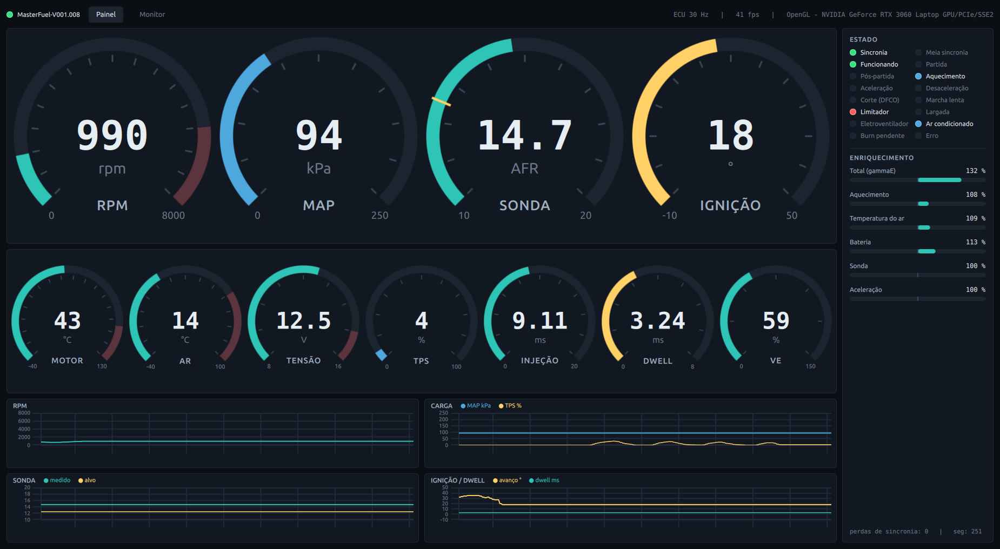

> **Leia antes de usar.** Toda edição feita aqui vai direto para a RAM da ECU e **vale no motor
> na mesma hora**, igual ao TunerStudio. Ela só fica permanente depois do "Gravar na flash". Faça
> um backup antes de mexer (veja [Primeiros passos](#primeiros-passos)), e prefira aprender na
> bancada antes de ir para o carro.

---

## Sumário

- [Requisitos](#requisitos)
- [Primeiros passos](#primeiros-passos)
- [Painel](#painel)
- [Monitor](#monitor)
- [Tabelas (tuning)](#tabelas-tuning)
- [Configuração](#configuração)
- [Linha de comando: `kgmctl`](#linha-de-comando-kgmctl)
- [Tuning básico do zero](#tuning-básico-do-zero)
- [Arquivos do projeto](#arquivos-do-projeto)

---

## Requisitos

- Linux com Python 3.10 ou mais novo.
- [PySide6](https://pypi.org/project/PySide6/) 6.8 ou mais novo (testado com 6.11) e
  [pyserial](https://pypi.org/project/pyserial/):

  ```bash
  pip install --user PySide6 pyserial
  ```

- Permissão para abrir a serial. Se der "permission denied" em `/dev/ttyUSB0`:

  ```bash
  sudo usermod -aG dialout $USER   # depois saia e entre de novo na sessão
  ```

- Qualquer placa de vídeo com OpenGL 3.3 ou Vulkan. Em notebook com NVIDIA + Intel, o app usa a
  NVIDIA sozinho.

> **Um programa por vez na serial.** O `mfgui.py` e o `kgmctl.py` não podem usar a porta ao mesmo
> tempo: um corrompe as respostas do outro. Feche um antes de abrir o outro.

---

## Primeiros passos

1. Ligue a ECU no USB e confira se ela responde:

   ```bash
   python3 kgmctl.py info
   ```

   ```text
   assinatura : <assinatura do firmware>
   produto    : <nome do firmware>
   protocolo  : v2, blocking factor 121, table blocking factor 64
   burn pend. : nao
   ```

   Se a porta não for `/dev/ttyUSB0`, use `--port /dev/ttyUSBx` ou exporte `KGM_PORT=/dev/ttyUSBx`.

2. **Faça backup do mapa inteiro.** Isso salva as 15 páginas de configuração em
   `backups/tune_<data>.json`:

   ```bash
   python3 kgmctl.py dump
   ```

   Para voltar a esse estado a qualquer momento:

   ```bash
   python3 kgmctl.py restore backups/tune_<data>.json          # só na RAM
   python3 kgmctl.py restore backups/tune_<data>.json --burn   # e grava na flash
   ```

3. Abra a interface gráfica:

   ```bash
   python3 mfgui.py
   ```

   | Opção | O que faz |
   |---|---|
   | `--port /dev/ttyUSB1` | Porta serial (padrão `/dev/ttyUSB0` ou `$KGM_PORT`) |
   | `--hz 30` | Quantas leituras por segundo pedir à ECU |
   | `--gpu nvidia` / `--gpu default` | Força a NVIDIA ou deixa o sistema escolher (padrão: `auto`) |
   | `--api vulkan` | Renderiza com Vulkan em vez de OpenGL |

   Se a ECU for desligada ou o cabo sair, o app mostra "offline" e reconecta sozinho quando ela
   voltar.

---

## Painel


**Barra de cima**

- O LED verde e a assinatura indicam que a ECU está conectada. Com a ECU desconectada, o LED
  apaga e aparece o motivo em vermelho.
- **ECU 30 Hz** é quantas leituras por segundo estão chegando da ECU.
- **fps** conta os frames realmente desenhados. O app só redesenha quando algo muda, então com o
  motor parado esse número cai, e isso é normal.
- No canto direito aparece qual placa de vídeo está desenhando a tela.

**Mostradores**

- Os quatro grandes são RPM, MAP, sonda (AFR) e avanço de ignição. Os sete menores são
  temperatura do motor e do ar, tensão, TPS, tempo de injeção, dwell e VE.
- A **faixa vermelha** no arco é a zona de alerta (RPM alto, motor quente etc.). Quando o valor
  entra nela, o número fica vermelho.
- No mostrador da sonda, o **tracinho amarelo** é o AFR alvo que a ECU está buscando naquele
  momento. Se o arco passa do tracinho, a mistura está mais pobre que o alvo; se fica antes, mais
  rica.
- Os ponteiros se movem suavemente, mas os números trocam 10 vezes por segundo para dar leitura.

**Gráficos** (últimos 10 segundos)

| Gráfico | Linhas |
|---|---|
| RPM | rotação |
| Carga | MAP (kPa) e TPS (%) |
| Sonda | AFR medido e AFR alvo |
| Ignição / dwell | avanço (°) e dwell (ms) |

**Estado.** Cada LED é um bit que a própria ECU informa:

| LED | Significado |
|---|---|
| Sincronia | A ECU reconhece a roda fônica e sabe a posição do motor |
| Meia sincronia | Só tem o sinal do virabrequim, sem o do comando |
| Funcionando / Partida | Motor em funcionamento / dando partida |
| Pós-partida | Enriquecimento logo após a partida (ASE) ativo |
| Aquecimento | Enriquecimento de motor frio (WUE) ativo |
| Aceleração / Desaceleração | Enriquecimento de aceleração rápida / empobrecimento na desaceleração |
| Corte (DFCO) | Corte de combustível em desaceleração |
| Marcha lenta | Controle de marcha lenta ativo |
| Limitador | Limitador de rotação atuando (soft ou hard) |
| Largada | Controle de largada atuando |
| Eletroventilador / Ar condicionado | Saídas ligadas |
| Burn pendente | Há uma gravação na flash esperando para acontecer |
| Erro | A ECU sinalizou erro |

**Enriquecimento.** Cada barra é uma correção que a ECU aplica no combustível. **100% = sem
correção**: a barra cresce para a direita quando a correção enriquece e para a esquerda quando
empobrece. "Total (gammaE)" é a multiplicação de todas. Por exemplo, aquecimento 108% × ar 109% ×
bateria 113% dá 132%.

---

## Monitor

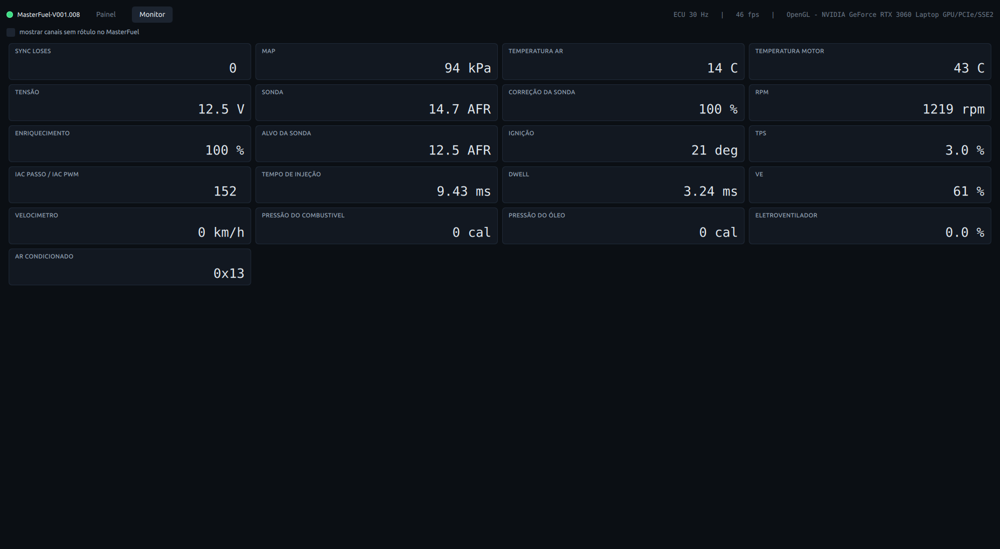

Todos os canais ao vivo da ECU em uma grade, com nome e unidade. Por padrão aparecem só os canais
com rótulo; a caixa no topo mostra também os internos (tempo ligada, cargas usadas nas tabelas,
bytes de status etc.). Canais do tipo "bits" aparecem em hexadecimal.

---

## Tabelas (tuning)

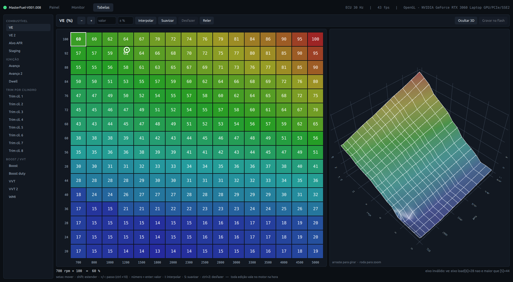

**Lista à esquerda:** as 20 tabelas da ECU, agrupadas.

| Grupo | Tabelas |
|---|---|
| Combustível | VE, VE 2, Alvo AFR, Staging |
| Ignição | Avanço, Avanço 2, Dwell |
| Trim por cilindro | Trim cil. 1 a 8 |
| Boost / VVT | Boost, Boost duty, VVT, VVT 2, WMI |

**Grade.** Linhas são carga (maior em cima) e colunas são RPM. Os valores já aparecem na unidade
real:

- VE em %;
- avanço em graus, com o offset de −40 da ECU já descontado;
- AFR com uma casa decimal;
- dwell em ms;
- trims em %, onde 0 = sem correção.

As tabelas de boost, VVT e WMI mudam de significado conforme o modo configurado, então aparecem
com o valor cru.

As cores vão do **azul** (menor valor da tabela) ao **vermelho** (maior).

**Cursor branco (⊙).** Mostra **onde a ECU está lendo a tabela agora**, com o RPM e a carga
atuais. É a ferramenta principal do tuning: você vê exatamente qual célula está comandando o
motor. Ele aparece em VE, Alvo AFR, Staging, Trims, Avanço e Dwell.

**Pontinho amarelo no canto de uma célula.** Aquela célula está diferente do que está gravado na
flash. Some depois de "Gravar na flash".

**Superfície 3D.** À direita, atualizada a cada edição. Arraste para girar, use a roda para dar
zoom, e "Ocultar 3D" dá mais espaço para a grade. Degraus e buracos na superfície costumam ser
erro de mapa.

**Barra de status** (embaixo)

- À esquerda, a célula selecionada (RPM × carga = valor) ou, com várias selecionadas, o mínimo, a
  média e o máximo.
- À direita, o resultado da última operação. "RAM atualizada (1 bytes, CRC ok) — não gravado na
  flash" quer dizer que a ECU recebeu e confirmou a escrita.
- **"eixo inválido"** avisa que um eixo da tabela não está em ordem crescente. A ECU interpola
  errado nessa região, então vale corrigir.

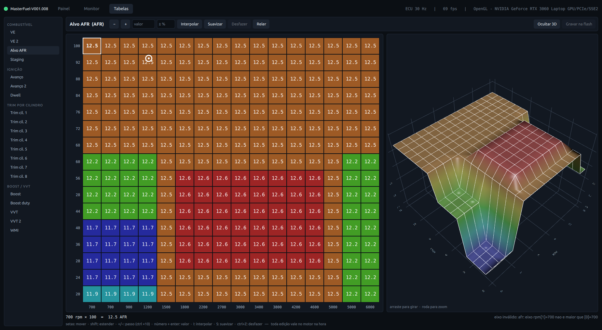

### Como editar

| Ação | Como |
|---|---|
| Selecionar uma célula | clique |
| Selecionar um bloco | arraste, ou Shift + clique, ou Shift + setas |
| Mover a seleção | setas |
| Selecionar tudo | Ctrl + A |
| Somar / subtrair um passo | `+` / `−` (ou botões, ou PageUp / PageDown) |
| Somar / subtrair 10 passos | Ctrl + `+` / Ctrl + `−` |
| Definir um valor | digite o número e aperte Enter |
| Aumentar / reduzir em % | campo "± %": `5` soma 5%, `-3` tira 3% |
| Interpolar | **I**: preenche a seleção a partir dos quatro cantos |
| Suavizar | **S**: média de cada célula com as vizinhas |
| Desfazer | Ctrl + Z (até 100 passos) |
| Reler da ECU | botão "Reler" |

O passo é a menor unidade da tabela: 1% no VE, 1° no avanço, 0,1 no AFR, 0,1 ms no dwell.

### O que acontece quando você edita

1. A célula muda na tela e a tabela é enviada para a **RAM** da ECU. **O motor já passa a usar o
   valor novo.**
2. A ECU confirma pelo CRC da página. Se algo falhar, o app avisa e relê a tabela para não ficar
   diferente da ECU.
3. O botão **"Gravar na flash"** fica amarelo. Enquanto você não gravar, desligar a ECU descarta
   tudo, o que é ótimo para experimentar sem medo.
4. Clique em **"Gravar na flash"** quando estiver satisfeito. O app espera a ECU confirmar que
   gravou de fato.

Segurar o `+` não entope a serial: o app manda só o estado final da tabela.

### Limitações atuais

- **Os eixos (RPM e carga) ainda não são editáveis pela interface.**

---

## Configuração

São 15 painéis com os campos de configuração agrupados por função. Cada campo aparece na unidade
real e só aceita valores dentro da faixa da ECU. Escolha o painel na lista à esquerda: o app lê as
páginas daquele painel na hora, e "Reler" busca de novo.

As capturas abaixo foram feitas com a ECU da bancada ligada a um simulador de roda fônica, com o
motor a ~1200 RPM e a ~43 °C.

### Como editar

| Tipo | Como |
|---|---|
| Número | `−` / `+` andam um passo da ECU (10 rpm, 0,1 s, 0,5 %...). Clique no campo, digite e aperte Enter; Esc desiste |
| Opções | clique na opção desejada |
| Curva | gráfico e, embaixo, a linha do eixo e a linha dos valores. Clique na célula, digite e aperte Enter; ↑ / ↓ andam um passo; Esc desiste |
| Só leitura | valor sem botões: o app mostra, mas não deixa mudar |

- **Ponto amarelo** à esquerda: o valor está diferente do que está na flash.
- **Linha apagada**: depende de uma chave que está desligada (ex.: tudo do A/C com o A/C
  desligado).
- **Linha vertical amarela na curva**: onde a ECU está lendo a curva agora (temperatura do motor,
  RPM, tensão...).
- **Eixo das curvas.** O eixo precisa ser crescente, então cada ponto fica limitado entre os
  vizinhos: digitar 5 °C entre 10 °C e 30 °C vira 10 °C.
- **"requer reiniciar a ECU"**: o firmware só lê esse campo ao ligar. Grave na flash e desligue e
  ligue a ECU.
- **"vale depois de gravar na flash"**: o campo fica numa área estendida da página 15, que o
  firmware só relê quando a página vai para a flash. Sem gravar, não muda nada no motor.
- **Estado ao vivo**: o último grupo de cada painel mostra, em LEDs e valores, o que a ECU está
  fazendo com aquela configuração.
- Os campos sem essas marcas **valem na hora**, direto na RAM. Para descartar tudo o que não foi
  gravado, desligue e ligue a ECU sem gravar.

Em cada painel, "Validado na ECU" diz o que foi mudado na RAM da bancada, o efeito medido no canal
ao vivo e se a releitura depois de restaurar bateu com a flash.

### Motor

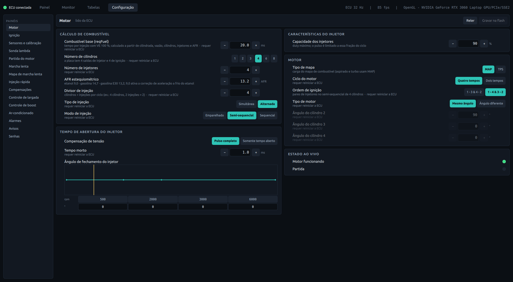

- Combustível base (`reqFuel`), cilindros, injetores, divisor e modo de injeção. Quase tudo aqui
  **requer reiniciar**: a ECU calcula o tempo base de injeção só ao ligar.
- **AFR estequiométrico**: use o do combustível do tanque (gasolina brasileira ~13,2, etanol ~9,0).
  Vale na hora.
- **Tempo de abertura do injetor**: tempo morto e a curva de correção por tensão da bateria.
- **Validado na ECU:** `reqFuel` de 20 para 22 ms não mudou o pulso até reiniciar, como o firmware
  prevê. Releitura igual à flash.

### Ignição

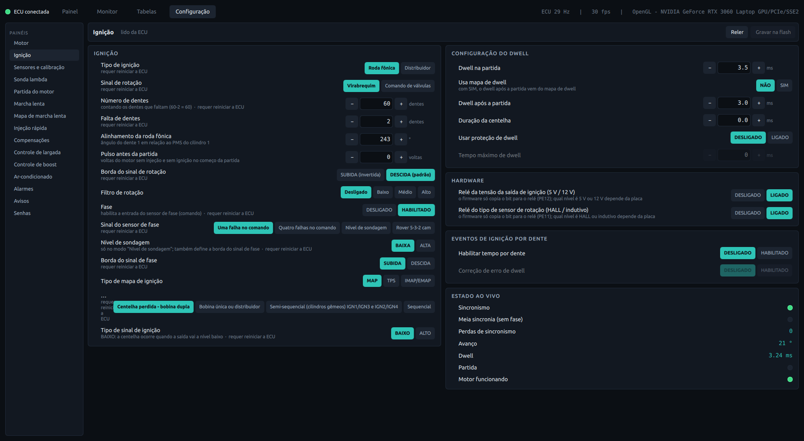

- Roda fônica (dentes, falha, alinhamento, borda do sinal), sensor de fase, modo de ignição e
  dwell.
- **Hardware** (tensão da saída de ignição e sensor HALL/VR) é **só leitura**: o firmware só
  repassa esses dois bits para relés da placa, e o efeito elétrico deles ainda não foi medido.
- O estado ao vivo mostra perdas de sincronia, avanço e dwell atuais.
- **Validado na ECU:** dwell de 3,0 para 4,0 ms levou o dwell ao vivo de 3,24 para 4,32 ms. A
  diferença é a correção por tensão.

### Sensores e calibração

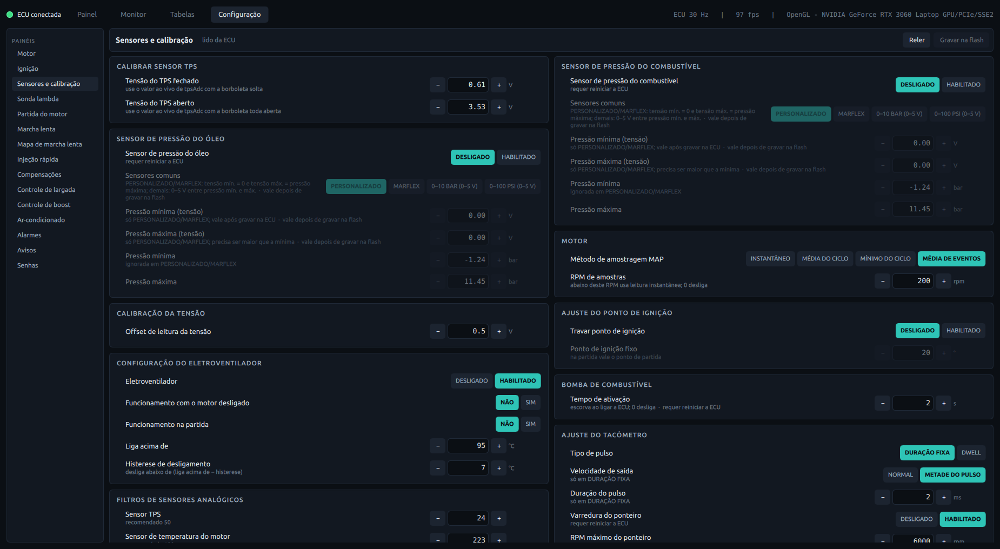

- **TPS**: grave a tensão com a borboleta solta e toda aberta.
- **Pressão de combustível e de óleo**: tipo de sensor (personalizado, Marflex, 0–10 bar,
  0–100 psi) e a faixa. Ligar o sensor requer reiniciar.
- **Ajuste do ponto de ignição**: trava o avanço num valor fixo para conferir com a lâmpada de
  ponto. **Destrave depois.**
- Offset da tensão, eletroventilador, bomba de combustível, tacômetro e filtros dos sensores.
- **Validado na ECU:** travar o ponto em 10° levou o avanço ao vivo de 21° para 10°.

### Sonda lambda

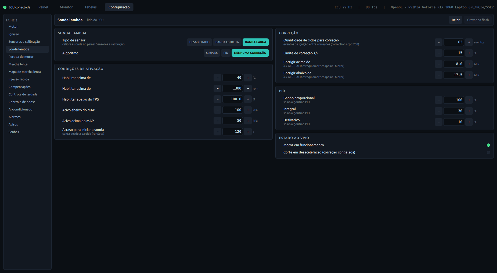

- Tipo de sonda, algoritmo (SIMPLES, PID ou NENHUMA CORREÇÃO) e limite da correção.
- **Corrigir acima de / abaixo de** estão em AFR. Para pensar em λ, divida pelo AFR
  estequiométrico do painel Motor.
- As condições de ativação (temperatura, RPM, TPS, MAP e espera após a partida) precisam estar
  todas satisfeitas para a correção entrar.
- **Validado na ECU:** algoritmo SIMPLES com ativação acima de 1000 RPM fez a correção ao vivo sair
  de 100 % para 104 %.

### Partida do motor

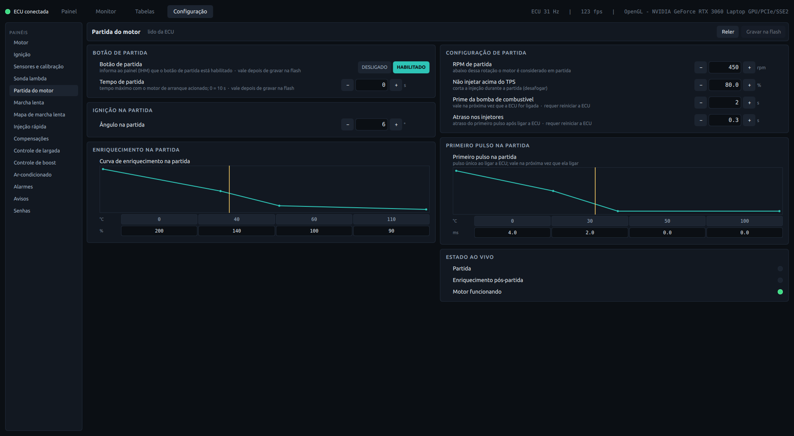

- Botão de partida (start/stop), RPM de partida, avanço na partida, curva do primeiro pulso
  (escorva) e curva de enriquecimento por temperatura.
- O botão de partida vale depois de gravar na flash.
- **Validado na ECU:** só a leitura. Com o motor girando no simulador, a condição de partida não
  aparece; o RPM de partida vai até 1000.

### Marcha lenta

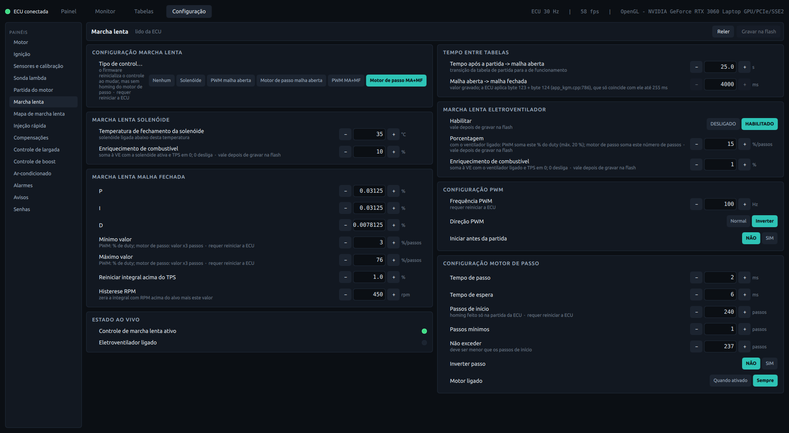

- Modo de controle (PWM ou motor de passo, malha aberta ou fechada): requer reiniciar.
- **Malha aberta → malha fechada** vai até 4000 ms e vale depois de gravar na flash. Firmwares
  mais antigos somam os dois bytes guardados em vez de montar o número de 16 bits. Nesses
  firmwares, os 4000 ms gravados na bancada viram 175 ms.
- Adicionais da lenta para o solenoide e o eletroventilador: valem depois de gravar na flash.
- Ganhos do controle em malha fechada, frequência do PWM e parâmetros do motor de passo.

### Mapa de marcha lenta

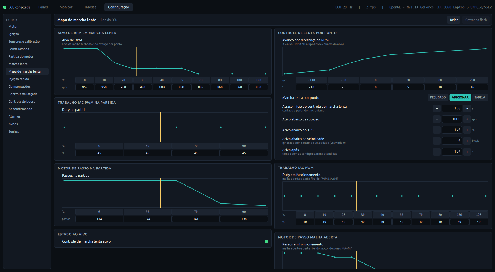

- Alvo de RPM por temperatura do motor, avanço da lenta por RPM e as curvas de abertura (PWM ou
  passos) na partida e em malha aberta.
- **Validado na ECU:** +100 RPM na curva de alvo levou o alvo ao vivo de 980 para 1080 RPM.

### Injeção rápida

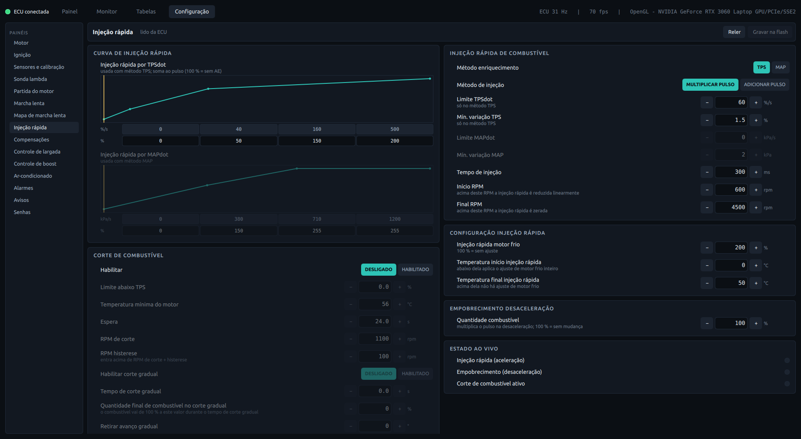

- Curvas de enriquecimento por velocidade do TPS e do MAP, limiares, enriquecimento a frio e
  empobrecimento na desaceleração.
- **Corte de combustível** (DFCO): TPS máximo, temperatura mínima, espera, RPM de corte e corte
  gradual.
- **Validado na ECU:** ligar o DFCO com TPS abaixo de 5 %, sem temperatura mínima e sem espera
  acendeu o LED de corte. Desligado, apagou.

### Compensações

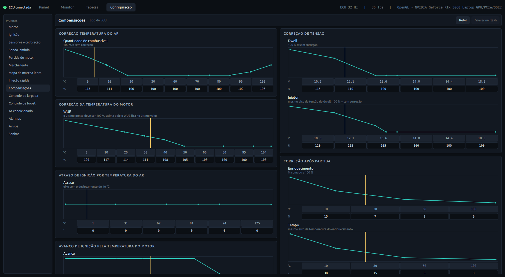

- Correções de combustível pela temperatura do ar, pela tensão da bateria (dwell e injetor), pelo
  aquecimento (WUE) e após a partida. Correções de ignição pela temperatura do ar e do motor.
- No WUE, o último ponto deve ser 100 %: acima dele a ECU fica no último valor.
- **Validado na ECU:** +10 % nos pontos de 40 e 50 °C levou a correção de aquecimento ao vivo de
  108 % para 118 %.

### Controle de largada

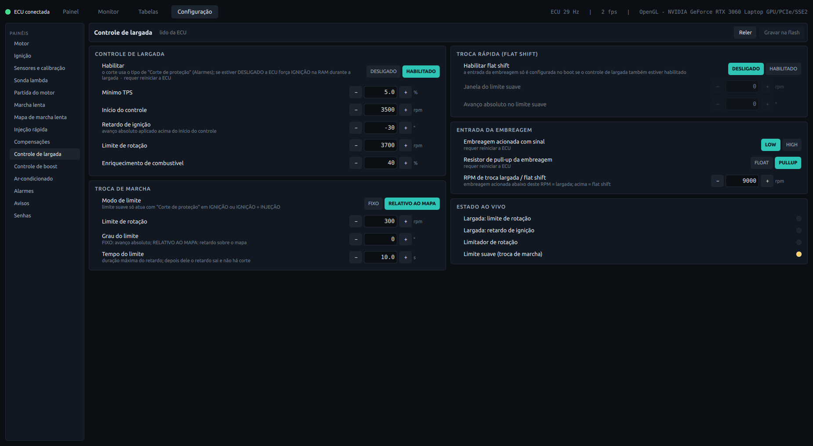

- Largada (TPS mínimo, RPM de início, retardo de ignição, limite de rotação e enriquecimento),
  troca rápida, entrada da embreagem e limite suave de rotação.
- Ligar a largada e configurar a entrada da embreagem requerem reiniciar.
- **Validado na ECU:** o limite suave de 300 para 5000 RPM apagou o LED do limite suave.

### Controle de boost

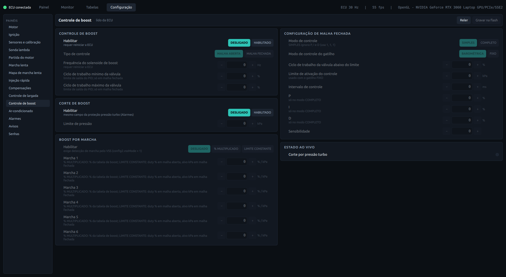

- Liga o controle e escolhe malha aberta ou fechada (requer reiniciar). Também tem os ganhos da
  malha fechada, o corte de boost e o boost por marcha.
- O **Corte de Boost** é o mesmo campo da "Proteção pressão turbo" do painel Alarmes.
- **Validado na ECU:** corte de boost em 50 kPa, com MAP de 94 kPa, acendeu o LED de proteção.

### Ar-condicionado

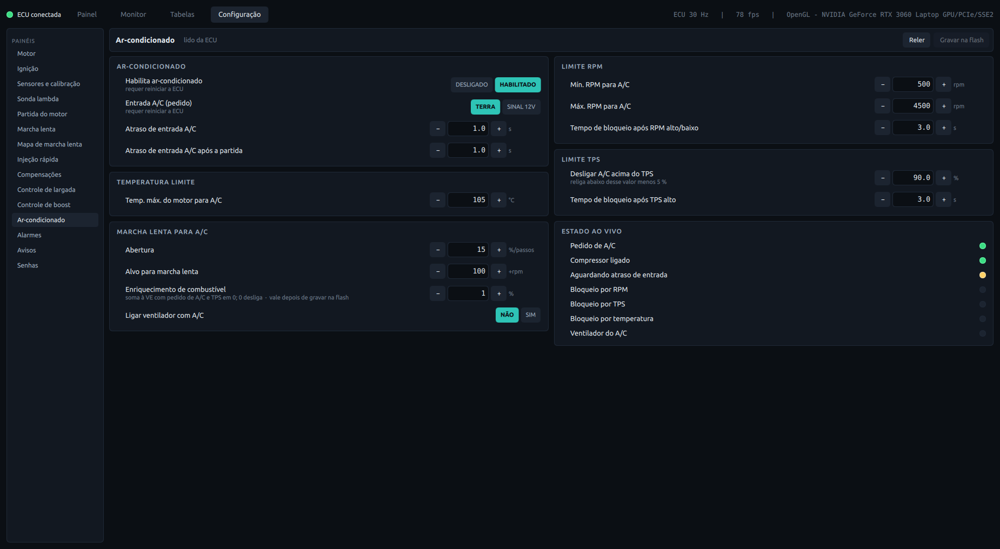

- Entrada do pedido (terra ou 12 V), atrasos e limites de RPM, TPS e temperatura para liberar o
  compressor.
- **Marcha lenta para A/C**: abertura e alvo extras com o A/C ligado. O enriquecimento de
  combustível vale depois de gravar na flash.
- **Estado ao vivo**: pedido, compressor, atraso e cada bloqueio (RPM, TPS, temperatura).
- **Validado na ECU:** o RPM máximo em 500 acendeu o bloqueio por RPM. Restaurado, apagou.

### Alarmes

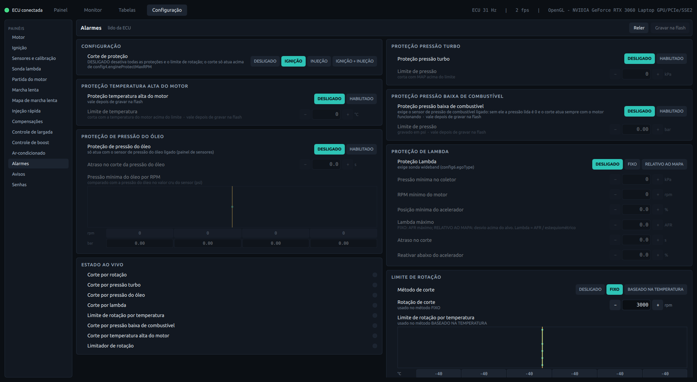

- **Corte de proteção**: o que a ECU corta quando uma proteção dispara (ignição, injeção ou as
  duas). Em DESLIGADO, nenhuma proteção nem o limitador de rotação atuam.
- Proteções por boost, temperatura alta do motor, pressão baixa de combustível, pressão do óleo
  por RPM e lambda pobre. Também tem o limitador de rotação (fixo ou por temperatura).
- **A proteção de pressão baixa de combustível corta sempre** se o sensor de pressão não estiver
  ligado: sem sensor, a pressão lida é 0.
- **Validado na ECU:** o limitador em 1000 RPM acendeu os LEDs de corte. A proteção de pressão de
  combustível só não cortou nada enquanto estava apenas na RAM. Depois de gravada (2 bar, sem
  sensor), cortou; desligada e gravada de novo, parou.

### Avisos

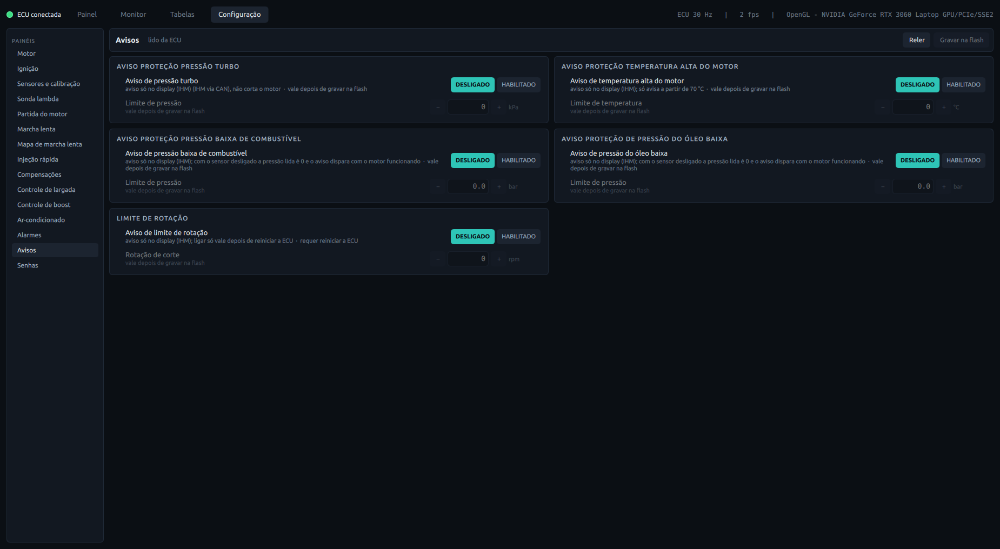

- Limites em que o display (IHM) avisa o motorista, antes das proteções do painel Alarmes: boost,
  temperatura, pressão de combustível, pressão de óleo e rotação.
- Tudo vale depois de gravar na flash; o aviso de limite de rotação também requer reiniciar. O
  aviso aparece só no display, não num canal ao vivo, então este painel foi validado só pela
  leitura.

### Senhas

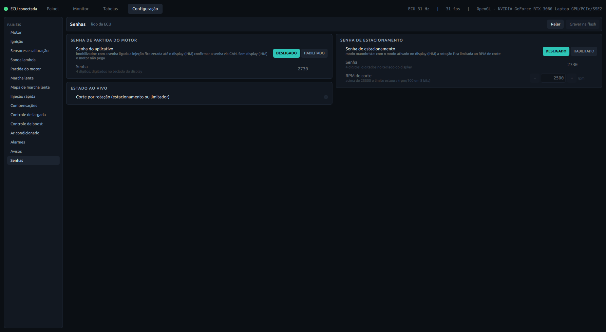

- **Só leitura.** A senha de partida é um imobilizador: com ela ligada, a injeção fica zerada até o
  display (IHM) confirmar a senha pela CAN. Um erro aqui deixa o motor sem pegar. Por isso o app só
  mostra os valores.
- A senha de estacionamento limita a rotação ao RPM de corte enquanto o modo estiver ativo no
  display.

### O que não tem painel

- **Sensor de velocidade**: a placa não tem entrada para ele.
- **Teste de saídas** (acionar injetor, bobina e relés com o motor parado): o firmware não desliga
  a saída sozinho se a comunicação cair. Fica de fora até ter uma proteção para isso.
- **Calibração dos sensores de temperatura e da sonda**: são tabelas enviadas por um comando
  próprio da ECU, não campos de configuração.
- **Remapeamento de saídas**: desativado no firmware.

---

## Linha de comando: `kgmctl`

Tudo o que a interface faz, e mais, pelo terminal. Útil para scripts, backup e para os
campos que não têm painel.

| Comando | O que faz |
|---|---|
| `kgmctl.py info` | Identidade da ECU |
| `kgmctl.py live` | Canais ao vivo no terminal (`--all` inclui todos, `--once` lê uma vez) |
| `kgmctl.py pages` | As 15 páginas, o que tem em cada uma e se o CRC confere |
| `kgmctl.py dump [-o arquivo]` | Backup completo em JSON |
| `kgmctl.py restore arquivo [--burn]` | Restaura um backup (só escreve o que difere) |
| `kgmctl.py table ve` | Mostra uma tabela (`--raw` para valor cru) |
| `kgmctl.py cell ve 3 5 [valor] [--burn]` | Lê ou altera uma célula (linha de carga 3, coluna de RPM 5, contando de 0 a partir do menor) |
| `kgmctl.py fields [config4] [--filter trig]` | Lista campos de configuração com os valores atuais |
| `kgmctl.py get dwellRun` | Lê um campo (`config4.dwellRun` ou só `dwellRun`) |
| `kgmctl.py set dwellRun 30 [--burn]` | Altera um campo (arrays como `100,105,110`) |
| `kgmctl.py burn 4` / `burn all` | Grava página(s) da RAM na flash |
| `kgmctl.py toothlog` | Captura o logger de dentes da roda fônica |

**Os campos de configuração são valores crus**, na unidade em que a ECU guarda. As escalas mais
usadas:

| Campo | Unidade crua | Exemplo |
|---|---|---|
| `reqFuel`, `injOpen`, `dwellRun` | 0,1 ms | `200` = 20,0 ms |
| `stoich` | AFR × 10 | `132` = 13,2 |
| `SoftRevLim`, `HardRevLim` | × 100 RPM | `65` = 6500 RPM |
| `wueBins`, `cltAdvBins`, `crankingEnrichBins` | °C + 40 | `100` = 60 °C |
| `wueValues` | % | `120` = +20% |
| `crankingEnrichValues` | × 5% | `40` = 200% |
| `FixAng`, `triggerAngle` | graus | `10` = 10° |

Toda escrita é conferida pelo CRC da página, e `restore` sempre salva antes um backup do estado
atual.

---

## Tuning básico do zero

Este é um roteiro para quem vai acertar um motor pela primeira vez com esta ECU. A ordem importa:
cada etapa depende da anterior.

> Acertar motor tem risco real: mistura pobre em carga alta e avanço demais **quebram motor**.
> Vá com calma, mude pouco de cada vez, e deixe plena carga e avanço agressivo para dinamômetro
> ou para quem já tem experiência. Este guia leva até um motor que funciona bem e com segurança,
> não até o limite.

### 0. Antes de ligar

**Equipamento**

- **Sonda lambda banda larga (wideband)** ligada à ECU. Sem ela não há como acertar combustível.
- Lâmpada de ponto (pistola estroboscópica) para conferir o ponto de ignição.
- Manômetro de combustível.
- Um extintor por perto.

**Motor em ordem.** Sem vazamento de vácuo nem de escapamento antes da sonda (entrada de ar falso
engana a sonda), velas e cabos bons, pressão de combustível correta.

**Backup:**

```bash
python3 kgmctl.py dump
```

### 1. Configuração base

Confira os valores com `python3 kgmctl.py fields config2` e ajuste com `set`. Cada `set` vale na
hora; grave com `--burn` quando estiver certo.

| Campo | O que é | Valores |
|---|---|---|
| `nCylinders` | número de cilindros | ex.: `4` |
| `strokes` | ciclo | `0` = 4 tempos, `1` = 2 tempos |
| `injLayout` | como os injetores disparam | `0` pareado, `1` semissequencial, `2` em banco, `3` sequencial |
| `fuelAlgorithm` | o que é "carga" no VE | `0` = MAP (recomendado), `1` = TPS (borboletas individuais / motor sem vácuo estável) |
| `stoich` | AFR estequiométrico do combustível, × 10 | gasolina pura `147`, **gasolina brasileira ~`132`**, etanol hidratado ~`84`–`90` |
| `injOpen` | tempo morto do injetor, 0,1 ms | ex.: `10` = 1,0 ms (dado do fabricante do injetor, em 13–14 V) |
| `reqFuel` | combustível base, 0,1 ms | ver abaixo |

**`stoich`: use o valor do combustível que está no tanque.** O mapa da bancada vem com `132` (13,2),
típico da gasolina vendida no Brasil, que tem etanol misturado. Confira também em que escala a sua
wideband informa o AFR, para os números baterem.

**`reqFuel`** é o tempo de injeção de um cilindro, no ciclo completo, com VE de 100%. A ECU divide
sozinha pelo número de injeções por ciclo. Uma conta boa para começar:

```
reqFuel (ms) = (cilindrada de 1 cilindro em litros × 1,204 ÷ stoich ÷ 0,74) × 60000 ÷ vazão do injetor (cc/min)
```

Por exemplo, um motor 2.0 de 4 cilindros (0,5 L por cilindro) com injetor de 250 cc/min e gasolina
pura (14,7) dá 0,5 × 1,204 ÷ 14,7 ÷ 0,74 × 60000 ÷ 250 ≈ **13,3 ms**. Para gravar:

```bash
python3 kgmctl.py set reqFuel 133
```

Não precisa acertar na casa decimal: o VE compensa depois. Só não pode estar muito longe, senão o
VE fica todo colado em 0 ou em 255.

### 2. Sensores

Com a ECU ligada e o motor desligado, abra a aba **Painel** e confira:

- **MAP** deve mostrar a pressão atmosférica local: ~100 kPa ao nível do mar, menos em altitude
  (ex.: ~94 kPa).
- **Temperaturas do motor e do ar** devem bater com a realidade (motor frio ≈ temperatura
  ambiente).
- **TPS** deve ir de 0% com o pedal solto a 100% com ele no fundo. Se não for, calibre os
  extremos. Leia o valor cru do sensor:

  ```bash
  python3 kgmctl.py live --all --once | grep tpsAdc
  ```

  Leia uma vez com o pedal solto e outra com ele no fundo, e grave os dois números:

  ```bash
  python3 kgmctl.py set tpsMin <solto> --burn
  python3 kgmctl.py set tpsMax <fundo> --burn
  ```

### 3. Roda fônica e ponto de ignição

1. Confira `TrigPattern`, `triggerTeeth` e `triggerMissingTeeth`. Uma roda 60−2 é `0`, `60` e `2`.
2. Dê partida e olhe o LED **Sincronia** e o contador "perdas de sincronia" no rodapé do Painel.
   O RPM deve aparecer estável e o contador não deve subir. Se subir, o problema é de sinal da
   roda fônica; resolva antes de continuar. O `kgmctl.py toothlog` ajuda a ver o sinal.
3. **Confirme o ponto com a lâmpada.** Isso garante que o avanço que a ECU acha que dá é o avanço
   real.

   ```bash
   python3 kgmctl.py set FixAng 10
   python3 kgmctl.py set fixAngEnable 1       # ignição travada em 10°
   ```

   Com o motor funcionando, aponte a lâmpada para a marca do volante. Se não estiver em 10°, ajuste
   `triggerAngle` até a lâmpada marcar 10°:

   ```bash
   python3 kgmctl.py set triggerAngle <valor>
   ```

   Depois destrave, que é essencial, e grave:

   ```bash
   python3 kgmctl.py set fixAngEnable 0
   python3 kgmctl.py burn all
   ```

### 4. Partida e marcha lenta

- Se o motor custa a pegar, aumente um pouco o enriquecimento de partida. Ele está em
  `crankingEnrichValues`, em **passos de 5%** (`40` = 200% do combustível normal), para cada
  temperatura de motor em `crankingEnrichBins`.
- Assim que pegar, o LED **Pós-partida** acende por alguns segundos. É normal a mistura ficar mais
  rica nesse momento.
- Com o motor frio, o LED **Aquecimento** fica aceso e a barra "Aquecimento" do Painel mostra
  quanto a ECU está enriquecendo. A curva está em `wueValues` (% para cada temperatura de
  `wueBins`). Deixe o acerto fino dela para o fim, com o VE já certo no motor quente.
- Para acertar a marcha lenta, **espere o motor aquecer** até a barra "Aquecimento" chegar a 100%.
  Na aba **Tabelas → VE**, o cursor fica parado nas células de baixa rotação e alto vácuo: é ali
  que você vai trabalhar primeiro (próxima etapa).

### 5. Acertando o VE (a parte principal)

O VE diz quanto ar o motor enche em cada rotação e carga. Com ele certo, a mistura real bate com o
alvo em todas as condições.

**1. Desligue a correção automática da sonda enquanto acerta.** Senão ela esconde o erro do mapa.
A leitura da sonda continua funcionando.

```bash
python3 kgmctl.py get egoAlgorithm         # anote o valor para restaurar depois
python3 kgmctl.py set egoAlgorithm 3       # 3 = sem correção
```

No Painel, a barra **"Sonda"** tem que ficar em 100%.

**2. Célula por célula.** Com o motor quente, mantenha uma condição estável: rotação e pedal
parados por alguns segundos. Na aba **Tabelas → VE**, o cursor mostra a célula em uso. Compare, no
Painel ou no gráfico "Sonda", o AFR **medido** com o **alvo**, e corrija a célula:

```
VE novo = VE atual × AFR medido ÷ AFR alvo
```

Por exemplo, com VE 45, alvo 13,2 e medido 14,5, a mistura está pobre: 45 × 14,5 ÷ 13,2 ≈ **49**.
Selecione a célula, digite `49` e Enter. Se o medido fosse 12,0, a mistura estaria rica:
45 × 12,0 ÷ 13,2 ≈ **41**.

Se o cursor estiver entre células, a ECU está misturando as vizinhas. Corrija as 2 a 4 células em
volta dele na mesma proporção: selecione o bloco e use o campo **± %**. No exemplo acima, 49 ÷ 45
dá +9%.

**3. A ordem que funciona:**

1. marcha lenta (baixa rotação, alto vácuo);
2. cruzeiro leve (1500 a 3000 RPM, pouca carga), que dá para acertar andando em marcha alta ou com
   carga leve;
3. cargas médias;
4. carga alta e plena carga, **por último, com cuidado** e de preferência em dinamômetro. Nunca
   fique em plena carga com a mistura pobre.

**4. Preencha o que você não visitou.** Selecione um bloco entre regiões já acertadas e aperte
**I** (interpolar). Depois passe um **S** (suavizar) leve. Olhe a superfície 3D: um VE bom é uma
superfície lisa, que sobe com a carga, sem buracos nem picos isolados.

**5. Grave com frequência.** "Gravar na flash" a cada bloco acertado, e um `kgmctl.py dump` no
fim de cada sessão.

**6. Quando terminar, volte a correção da sonda** para o valor anotado:

```bash
python3 kgmctl.py set egoAlgorithm <valor anotado> --burn
```

Com o VE certo, a barra "Sonda" deve ficar perto de 100% andando normalmente. Se a correção vive
alta ou baixa numa região, ainda tem acerto a fazer ali.

### 6. AFR alvo

A tabela **Alvo AFR** diz que mistura a ECU busca em cada ponto. Pense em **lambda (λ)**: λ = 1 é a
mistura estequiométrica de qualquer combustível, e o AFR alvo é λ × `stoich`.

| Região | λ sugerido | Com stoich 13,2 | Com stoich 14,7 |
|---|---|---|---|
| Marcha lenta e cruzeiro | 1,00 | 13,2 | 14,7 |
| Carga média | 0,93–0,95 | 12,3–12,5 | 13,7–14,0 |
| Plena carga, motor aspirado | 0,86–0,88 | 11,4–11,6 | 12,6–12,9 |
| Plena carga, turbo | 0,78–0,82 | 10,3–10,8 | 11,5–12,1 |

Os valores são pontos de partida conservadores; o acerto final de plena carga é de dinamômetro.

O mapa da bancada tem `incorporateAFR` = 1. Com isso, o alvo já entra no cálculo do combustível:
mudar o alvo muda a injeção diretamente, e o VE representa o motor em λ = 1. Por isso, **acerte o
VE com a tabela de alvo já definida** e não mexa nas duas ao mesmo tempo.

### 7. Ignição

A tabela **Avanço** está em graus antes do PMS.

- **Comece conservador.** Um mapa base "manso" perde potência, mas não quebra nada.
- Em **marcha lenta e cruzeiro de baixa carga** (muito vácuo), o motor aceita bastante avanço.
  Aumente de 1° a 2° por vez enquanto a rotação ou o consumo melhoram, e pare quando parar de
  melhorar.
- Em **carga alta**, cada grau a mais aumenta o risco de **detonação (batida de pino)**, que
  destrói pistão. Sem dinamômetro ou detecção de detonação, fique no conservador.
- Ouviu batida? **Tire avanço imediatamente** naquela região: selecione o bloco e use Ctrl + `−`
  (−10°) ou digite um valor menor.

A tabela **Dwell** (ms de carga da bobina) só é usada se `useDwellMap` = 1; senão vale o valor
fixo `dwellRun`. Use o valor recomendado para a sua bobina: dwell demais esquenta e queima a
bobina.

### 8. Aceleração rápida

Ao pisar rápido, entra ar de uma vez e a mistura empobrece por um instante. A ECU compensa com o
enriquecimento de aceleração: o LED **Aceleração** acende e a barra "Aceleração" sobe.

- No gráfico "Sonda", se o AFR medido dá um **pico para cima** (pobre) logo que você pisa, aumente
  `taeValues` (% de enriquecimento por velocidade de pedal em `taeBins`).
- Se dá um **pico para baixo** (rico, fumaça preta), diminua.
- `taeThresh` é a velocidade de pedal mínima para o enriquecimento entrar.

### 9. Limitadores

`SoftRevLim` e `HardRevLim` (× 100 RPM) são os limites de rotação. **Confira antes de andar.** Um
mapa de bancada pode ter limites baixos de propósito: o da nossa bancada corta em 3000 RPM.

```bash
python3 kgmctl.py get HardRevLim
python3 kgmctl.py set SoftRevLim 63 --burn   # 6300 RPM
python3 kgmctl.py set HardRevLim 65 --burn   # 6500 RPM
```

### 10. Rotina de cada sessão

1. `python3 kgmctl.py dump` antes de começar.
2. Edite na RAM e teste.
3. "Gravar na flash" quando estiver bom.
4. `python3 kgmctl.py dump` no fim.

Se algo ficar ruim, `python3 kgmctl.py restore backups/<arquivo>.json --burn` devolve a ECU para
aquele ponto.

---

## Arquivos do projeto

| Arquivo | Conteúdo |
|---|---|
| `mfgui.py` | Interface gráfica (ponto de entrada) |
| `kgmctl.py` | Linha de comando |
| `gui_backend.py` | Ponte entre a ECU e a interface: leitura em thread própria, editores de tabelas e de configuração |
| `config_panels.py` | Campos, rótulos e escalas de cada painel de configuração |
| `protocol.py` | Protocolo serial da ECU (quadros, CRC, comandos). Bloqueia os comandos que reiniciam a ECU |
| `pages.py` | Mapa das 15 páginas de configuração, tabelas e campos |
| `layouts.py` | Layout dos campos de configuração, **gerado** a partir do firmware (não editar à mão) |
| `gen_layouts.py` | Gera o `layouts.py` a partir do `firmware.elf` (rodar de novo se o firmware mudar os structs de configuração) |
| `channels.py` | Canais ao vivo: posição, escala, unidade e nome exibido |
| `qml/` | Telas (Painel, Monitor, Tabelas, Configuração) |
| `shaders/` | Shader dos mostradores. Compilado automaticamente para `.qsb` ao abrir o app |
| `backups/` | Backups feitos pelo `dump` e pelo `restore` |
| `docs/` | Imagens deste README |

Para regenerar o layout depois de mudar o firmware:

```bash
python3 gen_layouts.py caminho/do/firmware.elf
```
